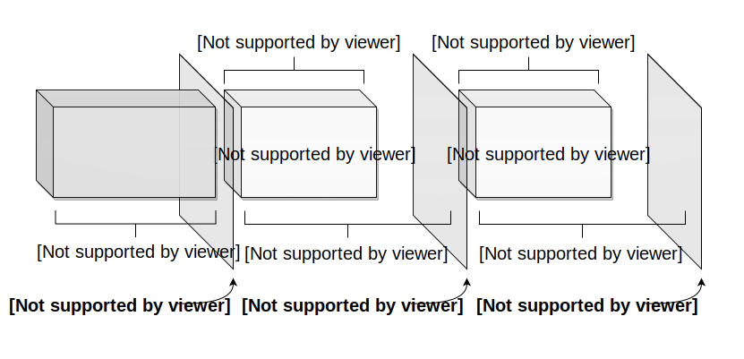
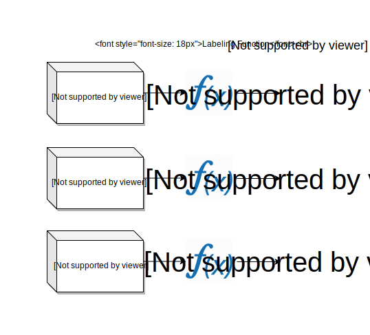

================
What is Compose?
================

.. toctree::
    :hidden:
    :maxdepth: 1

    install
    start
    tutorials
    user_guide
    resources
    api_reference
    release_notes

------------

|

|

**Compose** is a machine learning tool for automated prediction engineering. It allows you to structure prediction problems and generate labels for supervised learning. An end user defines an outcome of interest by writing a *labeling function*, then runs a search to automatically extract training examples from historical data. Its result is then provided to Featuretools_ for automated feature engineering and subsequently to EvalML_ for automated machine learning. The workflow of an applied machine learning engineer then becomes:

.. _Featuretools: https://docs.featuretools.com/
.. _EvalML: https://evalml.alteryx.com/

|

|

By automating the early stage of the machine learning pipeline, our end user can easily define a task and solve it.

.. _main-concepts:

Main Concepts
=============

Prediction problems are structured by using a *label maker* and a *labeling function*. The label maker automatically extracts data along the time index to generate labels. The process starts by setting the first cutoff time after the minimum amount of data. Then subsequent cutoff times are spaced apart using *gaps*. Starting from each cutoff time, a window determines the amount of data, also referred to as a *data slice*, to pass into a labeling function.

The labeling function will then transform the extracted data slice into a label.

When a labeling function returns continuous values, there are :doc:`label transforms </user_guide/using_label_transforms>` available to further process the labels into discrete values.

|
