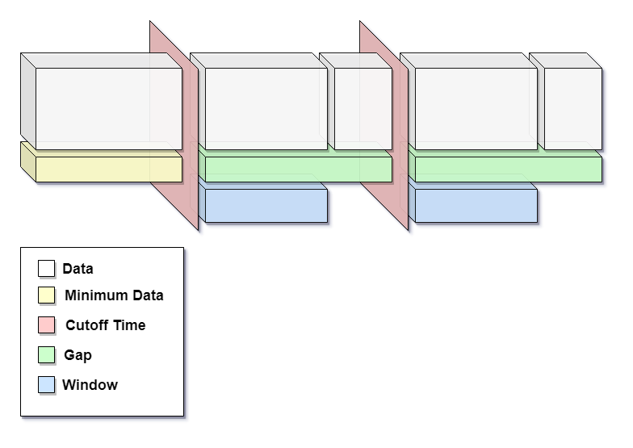

Main Concepts
=============

Label Maker
---------------

The label maker automatically extracts data along the time index to generate labels. The process starts by setting the first cutoff time after the minimum amount of data. Then subsequent cutoff times are spaced apart using **gaps**. Starting from each cutoff time, a window determines the amount of data, also referred to as a **data slice**, to pass into a labeling function. The labeling function will then transform the extracted data slices into labels.

